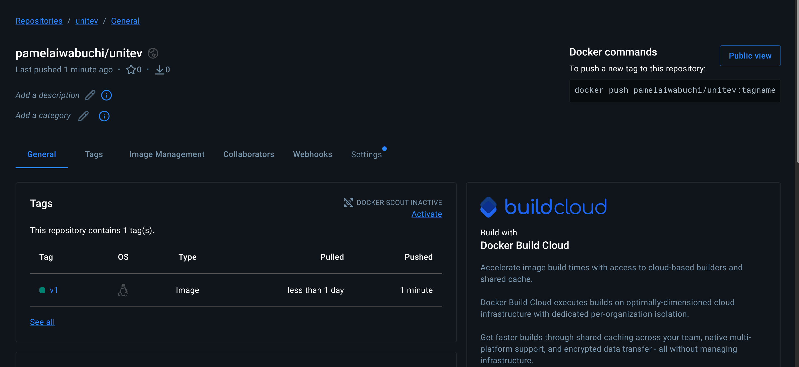

# UniTeV - Sistema de Gestão Acadêmica
O UniTeV é uma plataforma institucional dedicada à excelência tecnológica e ao fortalecimento da transparência acadêmica. O projeto foi desenvolvido com foco em escalabilidade e infraestrutura como código, utilizando Docker para padronização de ambiente e Flask para o processamento de dados.

## Tecnologias Utilizadas
- Backend: Python, Flask
- Banco de Dados: MySQL
- Infraestrutura: Docker & Docker Compose
- Frontend: Tailwind CSS
- Cloud: Railway (Deploy e Gerenciamento de Banco de Dados)

## Pré-requisitos
Para rodar este projeto localmente, certifique-se de ter instalado:
- Docker Desktop
- Git

## Distribuição
A imagem desta aplicação está publicada no Docker Hub e pode ser executada com o comando:
```bash
docker pull pamelaiwabuchi/unitev:v3
```


## Administração e Gestão
O sistema possui um painel administrativo para monitoramento dos dados coletados:

* **Rota de Acesso**: `/admin/visualizar`
* **Funcionalidade**: Exibição em tabela de todas as sugestões enviadas através do formulário principal, permitindo o acompanhamento centralizado do feedback dos usuários.

## Como Rodar o Projeto
1. Clone o projeto

```bash
git clone https://github.com/pamelaiwabuchi/universidade-unitev.git
cd universidade-unitev
```

2. Configure o ambiente:
Crie um arquivo .env na raiz do projeto com suas credenciais de banco de dados (seguindo o modelo .env.example):

```
MYSQLHOST=seu_host
MYSQLPORT=3306
MYSQLUSER=seu_usuario
MYSQLPASSWORD=sua_senha
MYSQLDATABASE=nome_do_banco
```
3. Suba a aplicação
Utilize o Docker Compose para orquestrar os containers:
```bash
docker-compose up -d --build
```

4. Acesse a plataforma:
Abra seu navegador em http://localhost:5000 .

*Projeto desenolvido como atividade da matéria de Desenvolvimento Web - FATEC*